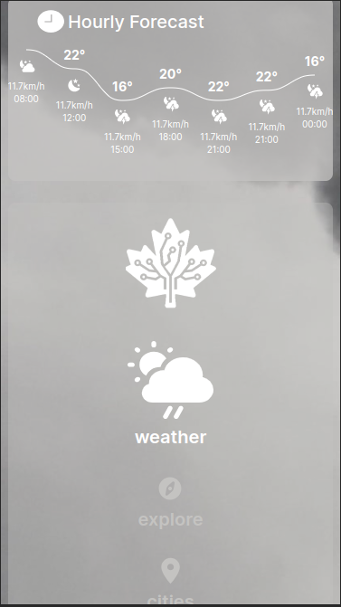

# Smart Maple React Task

## Project Description
This project created for achieving the example task from 'Smart Maple' company. The project shows the experience of the candidate software developer.

## Project Features
- Responsive Design
- Transitions / Animations
- Simple and Easy to Use UI
- Dynamic Data Display

## Packages Used For The Project
- Redux Toolkit
- Sass
- Swiper
- Recharts
- Framer Motion

## Important Note
You need to refresh page to view responsive design of each view. For example you need to set your width to '1200px' and refresh the page to see tablet view. Otherwise, layout problems and overflow issues may occur.

## Installation Guide
- clone the project &nbsp; `git clone https://github.com/Scholak/2ece89c0-c269-4882-ac99-60ff13ca91f3.git`
- move to the project directory &nbsp; `cd 2ece89c0-c269-4882-ac99-60ff13ca91f3`
- install dependencies &nbsp; `npm i` or &nbsp; `yarn install`
- run the app &nbsp; `npm run dev` or &nbsp; `yarn dev`
- visit &nbsp; http://localhost:5173

## Live Demo
https://funny-sorbet-8f1e41.netlify.app/

## Project Images

 
 

 
 

 
 

 
 

 
 

 
 

 
 

 
 
